# Data Lovers

## Índice

- [1. Definición del producto](#1-Definición-del-producto)
- [2. Historias de usuario](#2-Historias-de-usuario)
- [3. Prototipo de baja fidelidad](#3-Prototipo-de-baja-fidelidad)
- [4. Prototipo de alta fidelidad](#4-Prototipo-de-alta-fidelidad)
- [5. Tests de usabilidad](#5-Tests-de-usabilidad)
- [6. Plan de acción de tus objetivos de aprendizaje](#6-Plan-de-acción-de-tus-objetivos-de-aprendizaje)

---

## 1. Definición del producto

En este proyecto construiremos una aplicación web que le permita al usuario conocer el rol, niveles de ataque, defensa, velocidad o poder de cada campeón para poder elegir al mejor grupo de campeones para una partida.

## 2. Historias de usuario

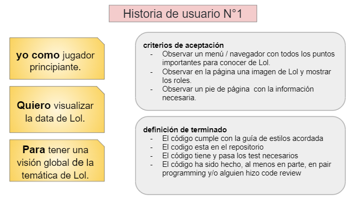

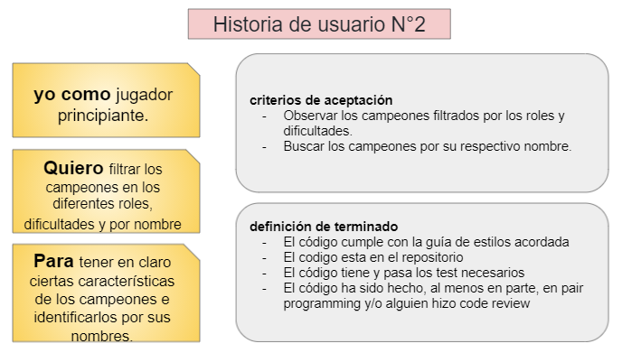

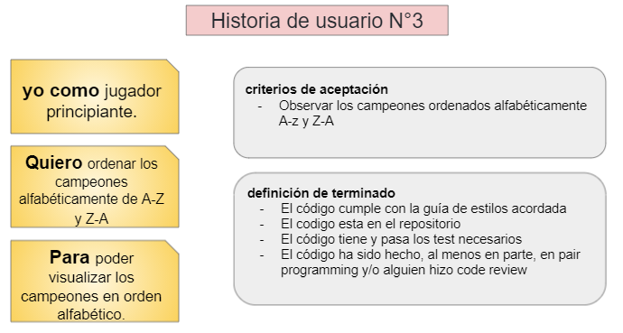

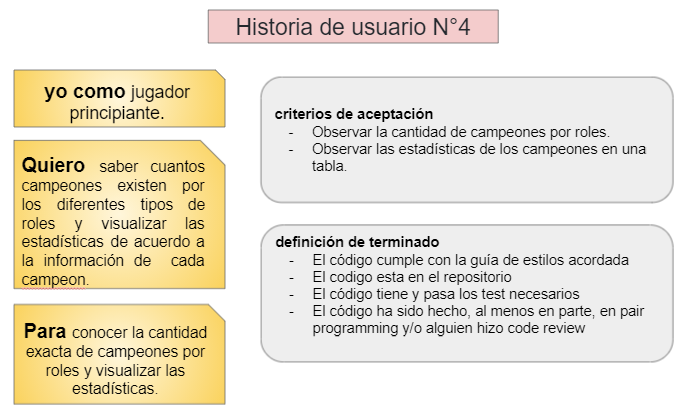

## 3. Prototipo de baja fidelidad

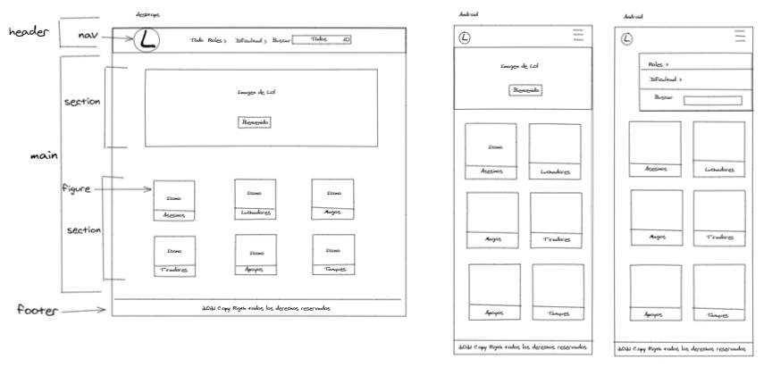

## 4. Prototipo de alta fidelidad

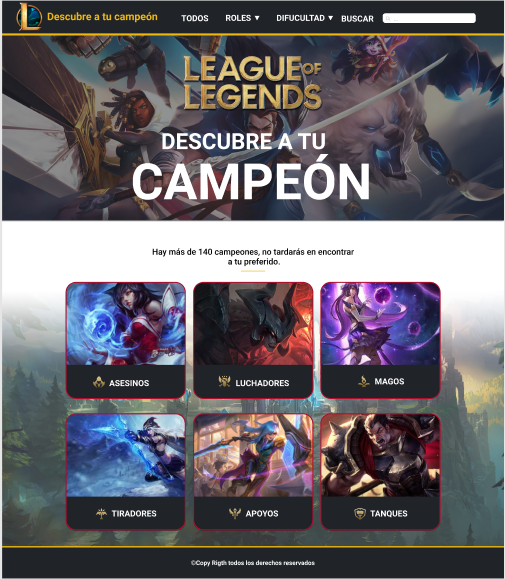

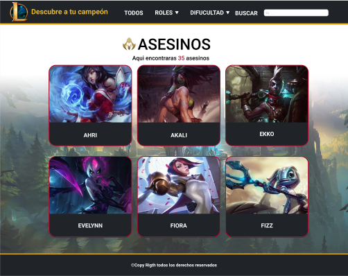

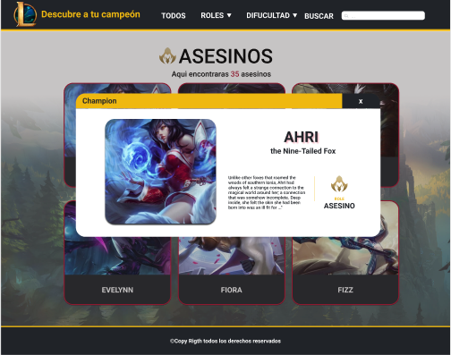

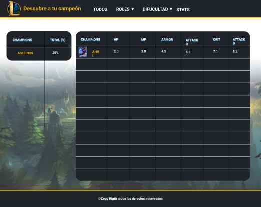

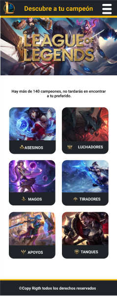

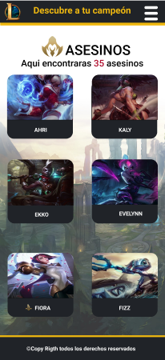

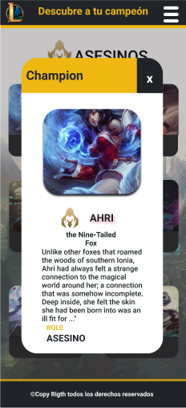

## 5. Tests de usabilidad

Se realizaron testeos de usabilidad en cada sprint, donde se pudo iterar el prototipo inicial, y adaptar el diseño a las necesidades del usuario.

-Se determinó en el primer Sprint la implementación de un slider-imagen que al final se eligió por cambiar por un video para que el usuario pueda tener una mejor experiencia.

-Se determinó en el segundo Sprint la implementación de cards estáticas pero se decidió cambiar por una card dinámica que tenga un giro de 180° y en la reversa de la card se mostrará la información que se consideró relevante de cada campeón.

-Se determinó en el tercer Sprint cambiar la posición del buscador a la vista en donde se encuentran todos los campeones donde en un principio se encontraba en el menu.

## 6. Plan de acción de tus objetivos de aprendizaje

### HTML y CSS

- Uso de HTML semántico.
- Uso de selectores de CSS.
- Construir tu aplicación respetando el diseño realizado (maquetación).
- Uso de flexbox en CSS.

### DOM y Web APIs

- Uso de selectores del DOM.
- Manejo de eventos del DOM.
- Manipulación dinámica del DOM.

### JavaScript

- Uso de condicionales (if-else | operador ternario)
- Uso de bucles (forEach)
- Uso de funciones (parámetros | argumentos | valor de retorno)
- Manipular arrays (filter | sort )
- Manipular objects (key | value)
- Uso ES modules[import - export]
- Diferenciar entre expression y statements.

### Testing

- Testeo unitario.

### Estructura del código y guía de estilo

- Organizar y dividir el código en módulos (Modularización)
- Uso de identificadores descriptivos (Nomenclatura | Semántica)
- Uso de linter (ESLINT)

### Git y GitHub

- Uso de comandos de git (add | commit | pull | status | push)
- Manejo de repositorios de GitHub (clone | fork )
- Colaboración en Github (branches | pull requests )

### UX

- Diseñar la aplicación pensando y entendiendo al usuario.
- Crear prototipos para obtener feedback e iterar.
- Aplicar los principios de diseño visual (contraste, alineación, jerarquía)
- Planear y ejecutar tests de usabilidad.
